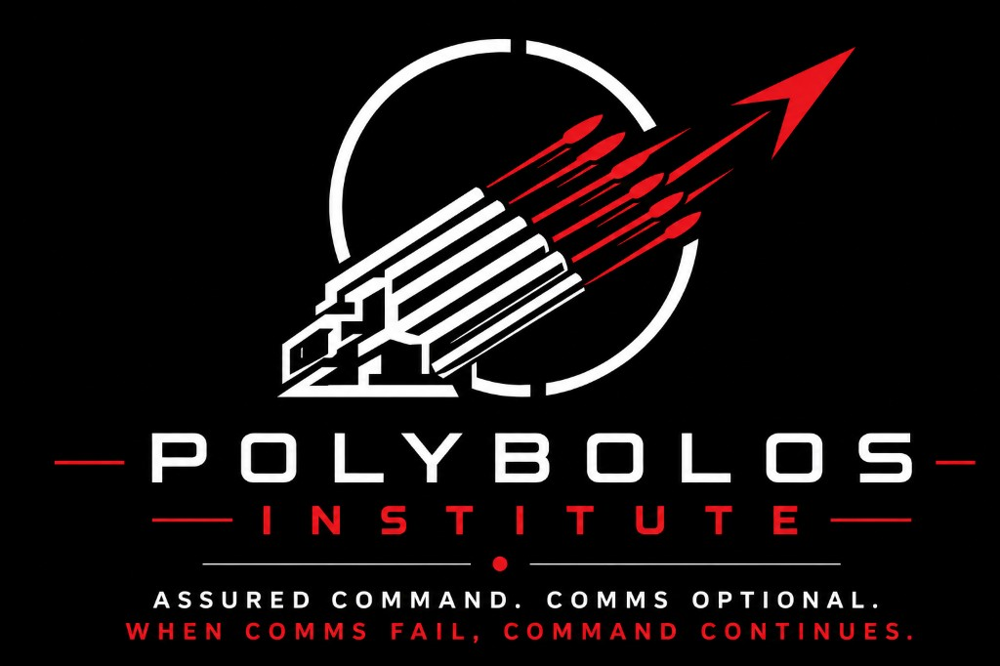

 

We study how defense systems fail under stress: decision latency, saturation, denied communications, and human-on-the-loop authority when the network is gone. Not in theory. Under stress.

Polybolos Institute is a 501(c)(3) nonprofit research organization and registered charity. Named after the ancient repeating ballista, we build open tools and Decision-C2 research so command continues when comms fail.

**Assured Command. Comms Optional.**  
**When Comms Fail, Command Continues.**

### Command Intelligence

Polybolos Command Intelligence is a private institute platform. Source is not published on this account. For inquiry: [contact@polybolos.org](mailto:contact@polybolos.org)

### Links

- Website: [polybolos.org](https://www.polybolos.org)
- Publications: [polybolos.org/publications.html](https://polybolos.org/publications.html)
- Evaluation Engine: [polybolos.org/eval/](https://polybolos.org/eval/)
- Contact: [Contact@Polybolos.org](mailto:Contact@Polybolos.org)

Independent Lattice interoperability samples on this account are research doors only. Not Anduril products. No engage authority.
